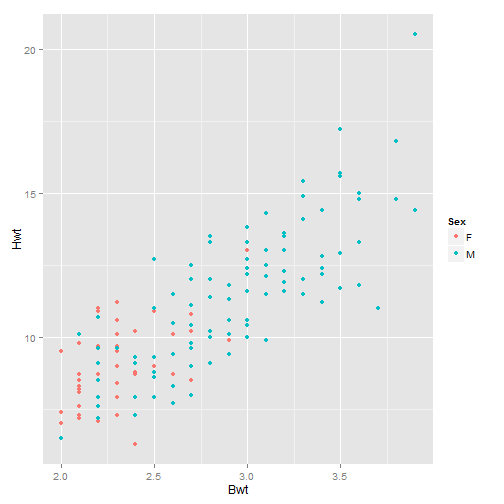
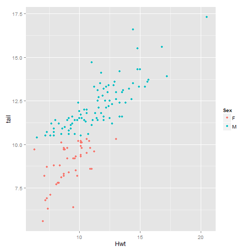

I'm going to ask you a series of multiple choice questions. Please answer honestly but also the way I want you to answer.

1. We're working on a group project. I add my section to the paper. Now it's your turn to write the conclusion. How would you want me to send the updated version of the paper to you?  
a) as a PDF file  
b) as a magical type of file that can be edited and then generate the newer version of the PDF  
c) as a Word Doc (don't pick this)  
d) both a and b  
e) both d and c but not b  
f) at least two of the above but I'm not sure which two  
g) I pick b because I think Gandalf might be involved somehow  

2. You're reading an interesting article on the growing average length of cat tails since the 1990s. There are many beautiful charts and graphs, and you know the author used R to produce these meowvelous graphics, but after extensive googling you can't find examples of the R code anywhere. The author also cited the data, but you know she manipulated it in various ways before her computations and would like to see exactly what she did, but... you can't. It's just a bunch of words, graphics, and pictures of cats. How does this make you feel?  
a) happy  
b) angry  
c) indifferent (don't pick this)  
d) pretty bad but the kitty pics make up for it  
e) both b and d  

3. Gandalf arrives at your doorstep and starts babbling about dynamic documents, compendiums, something about the end of the world, and being able to update "Mission: Mt. Doom" from afar without having to take 4-day trips to hold a meeting at a centralized location in Middle Earth every time there's a change in the plan. Basically, he has a solution to both of your problems above. What's your response?  
a) "You're incredible!"  
b) "Gandalf, you crazy."  
c) "I want to go to there."  
d) "Sign me up!"  
e) all of the above  

All jokes aside, I think you see where I'm going with this. There are remarkable tools at your fingertips that, to put it very generally, will make collaboration and sharing of code, data, and documents extremely easy and pliable. Robert Gentleman and Temple Lang discuss this in their paper "Statistical Analyses and Reproducible Research." It can be frustrating and inefficient when working in a group on research or projects and you find yourself sending the "most updated" version of the work back and forth, back and forth, back and forth... Sometimes multiple people made changes independently, and now there are multiple copies of the project with some changes but not all, and you must painstakingly go through each version, find where they differ, cut and paste, piece it all back together, etc. It is just as frustrating to be reading about someone else's work but have no insight into her programming methods, code, or data. 

Luckily, there is such a thing as "reproducible" research, which allows you to bypass these types of problems. The term comes from the idea that you have the ability to fully reproduce the work yourself, without making duplicate copies of data, code, or output files. Your colleagues and classmates can do the same. This is in line with the "DRY" principle: Don't Repeat Yourself. If you have not heard of this before, it the overall jist of it is: duplicate things are dangerous. We want one copy of the data and code that can be accessed by anyone on the team, rather than local copies floating around everywhere. Remember that one time you worked on research over the holidays on your grandma's computer? And then you had to change your file path to ".../Users/Granny/Documents/PumpkinsWork"? Yeah, we don't need that. More importantly, we don't want that. We want to edit one file stored in one location. This is especially useful that one day 7 months into your project when you realize that one of your initial computations, in which you calculated an AVERAGE, was wrong, and it completely changed your graphs, analysis, key findings in the paper, etc... (not that this happened to me, ever--this is a completely hypothetical example of course). Anyway, by not "repeating yourself" with your data and code and files, it will be very easy to make the necessary change in the code, fix the error, and... Move! That! Bus! I mean--recompile that PDF. You know what they say... If at first you don't succeed, DRY, DRY again.

Gentleman and Lang go into detail on reproducible research and its applications in dynamic documents (rather than static ones, like the Word or PDF file that keeps getting sent back and forth between everyone for editing). They begin by describing a compendium, which is a mechanism that combines data, text, and supporting software into a form that can be distributed and executed by other users. A compendium is what transforms a static document into a dynamic one, similar to the way LaTeX generates a PDF from the code you have written.

As mentioned above, one of the primary advantages of the reproducible code used in dynamic documents is the ease it offers to researchers and academes who are collaborating on a single study. No more sending pix msgs of your code. No more faxing instructions and updates. No. More. Floppy disks! The applicability of dynamic documents can be extended outside the sphere of research groups and teams to the general public: interested readers of a blog or paper, for example. Dynamic documents allow users to have access to code, files, etc. and enable them to generate the same output themselves on their own computer. For example, right now you are able to see the R code that an anonymous feline fanatic used to generate the graph of cat body weight vs. heart weight below:


```r
cats <- read.csv("http://www.calvin.edu/~stob/data/cats.csv")
library(ggplot2)
qplot(Bwt, Hwt, data = cats, colour = Sex)
```

 

Cool! Cats! We see a positive relationship between body weight and heart weight, which seems reasonable, and we have access to the code and the R functions used to generate the plot. We could reproduce this in the exact same fashion. But what if all of a sudden cat woman spits out a plot of heart weight vs. tail length. And she doesn't show you the code.
 

From this plot, you would probably gather that there is a pretty strong positive relationship between a cat's heart weight and the length of her tail. But is this legit? More importantly, where did this tail data come from?! Asking questions is good. We should always be questioning data collection and methods of analysis, not necessarily in a cynical or accusatory way, but simply in a healthy way. We should want to know where the data come from, and how conclusions have been made. Reproducible code allows us to find answers to such questions. Let's see what we find out when the code and data are viewable, and therefore reproducible--by you!


```r
cats$tail <- rnorm(nrow(cats), mean = 11, sd = 2)
cats$tail <- round(cats$tail, digits = 1)
cats$tail <- sort(cats$tail, decreasing = FALSE)
head(cats)
```

```
##   Sex Bwt Hwt tail
## 1   F 2.0 7.0  6.7
## 2   F 2.0 7.4  6.9
## 3   F 2.0 9.5  7.7
## 4   F 2.1 7.2  7.7
## 5   F 2.1 7.3  7.9
## 6   F 2.1 7.6  7.9
```

```r
qplot(Hwt, tail, data = cats, colour = Sex)
```

 


What's going on here? Some crazy cat lady wanted to make it seem like there's a positive relationship between heart weight and tail length. Why? Who knows. Maybe to show that short-tailed cats have hearts of stone, and thus all 27 of her long-tailed cats are the sweetest kitties in the world. Now that her code is visible (and reproducible), we can see that she did some pretty sneaky stuff to get the result she wanted. She created a new variable in the data set, but it's composed of random numbers! From a normal distribution with mean 11 and standard deviation 2. Where did she get this information? Then she rounded all the numeric values of the new `cats$tail` variable to one decimal place, most likely to match the format of the other two variables. THEN she sorted `cats$tail` in increasing order to try to achieve a more positive association between heart weight and tail length. So... now that you have access to her data and methods, what do you think? Is there a relationship between tail length and heart weight? No. Not based on her methods anyway. Is there a relationship between number of cats owned and mental stability? Absolutely. Proof. Right. Here.

As you can see from the above example, immediate and full access to data and methods of analysis also serve as a check on accuracy and integrity. As much as I would love to fudge data to show that eating cheese actually lowers the risk of heart disease, because of reproducibility I cannot. Many, who are not living in a false reality where cheese is the new acai berry, would undoubtedly call me out on my deceptive methods and innacurate calculations. So now, because of reproducible code and dynamic documents, all the readers of my blog--like President Obama, Ellen DeGeneres, and Bill Nye the Science Guy--can see what I'm doing, how I'm doing it, and where my data came from. Ugh. I'm going to get *so* many calls from the President...
